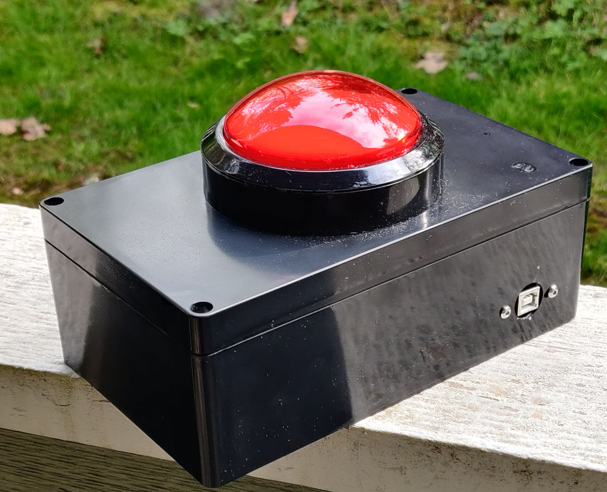

# the-button
A big red button.

## What?

It's a big red button which acts as a keyboard input. Using the Digistump ATTINY85
it can act as a single key or send any text.

## Why?

I needed a prop for a live demo. Even better that it functions as a real keyboard.
I think at some point I'll start using it as a play/pause media button, or see if I
can set up some macros.

## Parts List

| Item | Price |
| ---- | -----:|
| [Easyget 5v 100mm Dome Shaped Jumbo LED... (Amazon)][button-amazon] | $13 |
| [Generic 200x120x75mm Project Enclosure (Amazon)][box-amazon] | $13 |
| ATTINY85 Digispark Board (AliExpress) | <$1 |
| [Panel-mount USB Type B Connector (Amazon)][usb-amazon] | $9 |
| Various wires, connectors, etc. | ? |
| **Total** | ~$36 |

[button-amazon]: https://www.amazon.com/Easyget-Shaped-Illuminated-Self-resetting-Projects/dp/B00XRC9URW
[box-amazon]: https://www.amazon.com/gp/product/B07D23BF7Y
[usb-amazon]: https://www.amazon.com/gp/product/B07G4XYJ5W